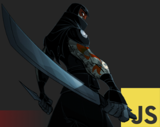
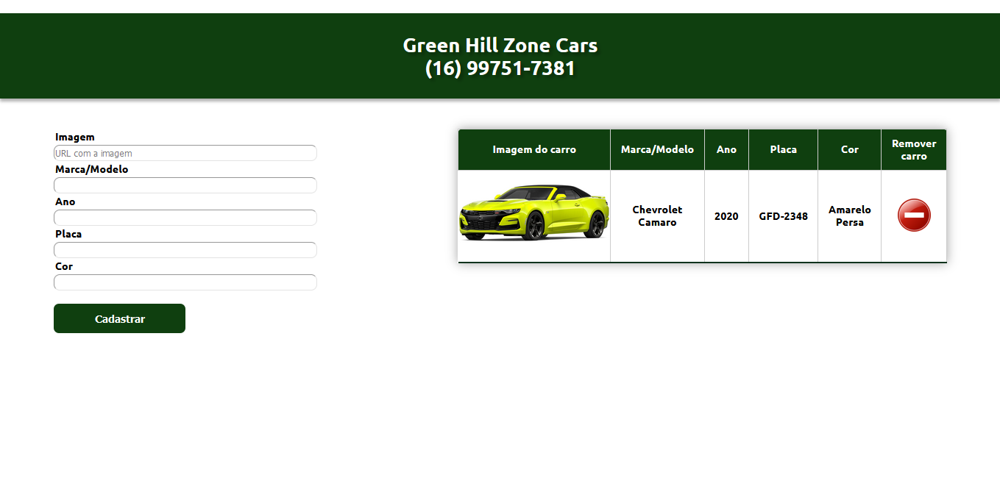

<h1 align="center">
  <br>
  Projeto final do curso JavaScript Ninja
</h1>
<p align="center">
  <a href="https://www.udemy.com/course/curso-javascript-ninja/">
    
  </a>
  
</p>

<br>

### Projeto

O projeto final do curso JavaScript Ninja foi um CRUD de carros, com a manipulação toda feita por JavaScript. Nesse sistema podemos:

 - Cadastrar carros em uma tabela contendo a informações: Imagem, Marca/Modelo, Ano, Placa e Cor;
 - Deletar os carros da tabela (No front-end e no servidor).

Essa é uma imagem do layout (Algo padrão, pois não foi o foco do curso essa parte visual... Esse é somente o último dos projetos feitos!).



### Tecnologias usadas
O projeto foi desenvolvido com as seguintes tecnologias:
- [HTML5](https://www.w3schools.com/html/)
- [CSS3](https://www.w3schools.com/css/)
- [JavaScript](https://developer.mozilla.org/pt-BR/docs/Aprender/JavaScript)
- [Node.js](https://nodejs.org/en/)
- [Express](https://expressjs.com/pt-br/)

### Como usar?

 - É necessário ter o [Node.js](https://nodejs.org/en/) instalado na máquina.

 - Usar o gerenciador de pacotes [npm](https://www.npmjs.com/) para instalar o projeto e suas dependências.

```bash
$ npm init -y
$ npm install express
$ npm install nodemon -D
```

### :runner: Rodar o projeto

###### Back-end
 - Dentro da pasta server, usar o comando <b>nodemon app.js</b> para iniciar o servidor. Usamos o nodemon para observar as alterações de código.
 
```bash
nodemon app.js
```

###### Front-end
 - Para subir a parte front-end do projeto, suba um servidor na raíz do projeto com o comando <b>http-server -p 9001</b>.

```bash
http-server -p 9001
```
 - Agora é só entrar no seu navegador preferido e digitar http://localhost:9001 ou clicar [aqui](http://localhost:9001) para estar acessando o projeto :) 

### :mortar_board: Quem ministrou?

O curso JavaScript Ninja foi ministrado pelo professor [Fernando Daciuk](https://github.com/fdaciuk). 

### Sobre o projeto

É um projeto que usa muitas funcionalidades do JavaScript, toda a manipulação é feita com a linguagem. É muito bom para treinar as habilidades desenvolvidas durante o curso!

### Aprendizado

Aprendi a criar uma mini biblioteca, manipular o DOM de uma forma bacana, usamos o module pattern que organiza bastante o código, muito interessante. Recomendo o curso pois vai a fundo na linguagem JavaScript!

---
